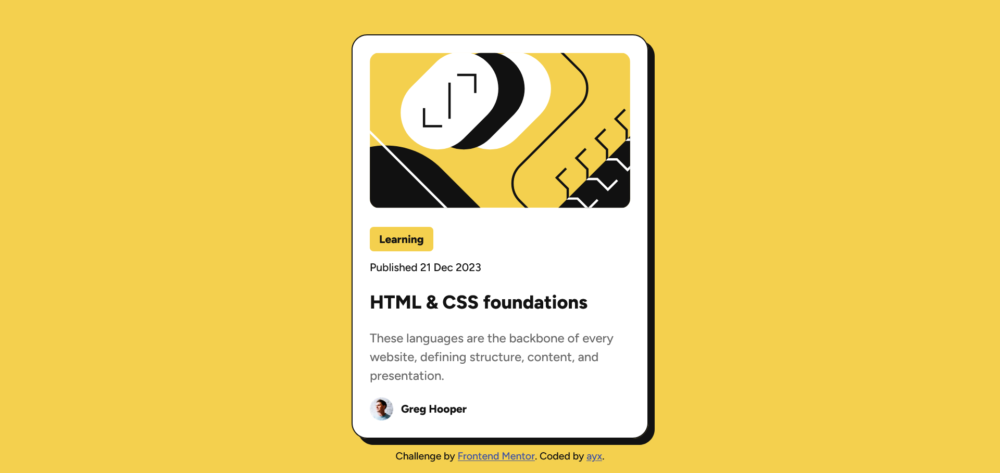

<!-- @format -->

# Frontend Mentor - Blog preview card solution

This is a solution to the [Blog preview card challenge on Frontend Mentor](https://www.frontendmentor.io/challenges/blog-preview-card-ckPaj01IcS). Frontend Mentor challenges help you improve your coding skills by building realistic projects.

## Table of contents

-   [Overview](#overview)
    -   [The challenge](#the-challenge)
    -   [Screenshot](#screenshot)
    -   [Links](#links)
    <!-- update link after getting solution and live site -->
-   [My process](#my-process)
    -   [Built with](#built-with)
    -   [What I learned](#what-i-learned)
    -   [Continued development](#continued-development)
    -   [Useful resources](#useful-resources)
-   [Author](#author)

## Overview

-   Make a responsive card component linking to an article

### The challenge

Users should be able to:

-   See hover and focus states for all interactive elements on the page

### Screenshot



### Links

-   Solution URL: [Add solution URL here](https://github.com/ayx234/blog-preview-card-main)
-   Live Site URL: [Add live site URL here](https://your-live-site-url.com)

## My process

### Built with

-   Semantic HTML5 markup
-   CSS
-   Flexbox

### What I learned

```css
settingstouselocalfonts: @font-face {
	font-family: "Figtree";
	/* format("ttf"); does not work. It has to be "truetype" */
	src: url("/assets/fonts/Figtree-VariableFont_wght.ttf") format("truetype");
	font-weight: 300 900;
	font-display: swap;
}

settingstochangeaspect-ratio: img, div, etc... {
	aspect-ratio: 1.4 / 1; /* example ratio numbers */
	width: 100%; /* Without this, aspect ratio uses the original img's width, not width on page */
	height: auto; /* Allows the image to adjust its height based on the aspect ratio */
	max-width: 100%; /* prevents overflow */
	object-fit: cover; /* ensures that the entire area defined by the aspect ratio is covered by the image content */
}
```

### Continued development

Focus areas:

-   CSS flexbox and grid
-   Other layout material

Improvement areas:

-   Variable fonts

### Useful resources

-   [info and CSS for variable fonts](https://wakamaifondue.com/) - Showed me font-weight range of the variable font
-   [Intro to variable fonts - Kevin Powell](https://www.youtube.com/watch?v=0fVymQ7SZw0&t=640s)

## Author

-   Frontend Mentor - [@ayx234](https://www.frontendmentor.io/profile/ayx234)
